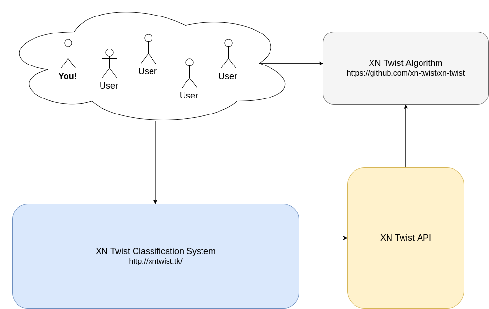

## What is XN-Twist?

XN-Twist is a project whose goal is to help individuals and organizations identify [internationalized domain names](https://wikipedia.org/wiki/Internationalized_domain_name) that may be spoofing (domain/typo-squatting on) their domain(s).

